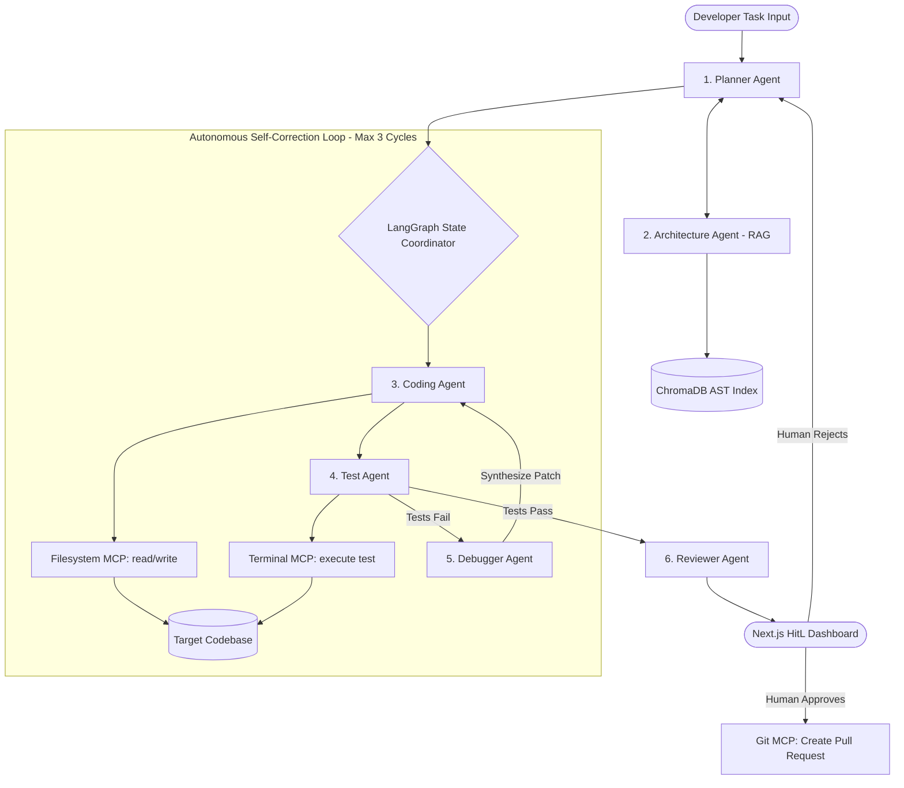

# IP FORGE: System Architecture & Master Implementation Blueprint

**Project Name:** IP FORGE (Federated Orchestrator for Reliable Generation & Engineering)  
**Hackathon:** Lablab x AMD AI Academy Hackathon  
**Target Challenges:** Challenge 5 (Multi-Agent Software Engineering), Challenge 3 (Proprietary RAG), AMD GPU Acceleration  
**Lead Developer:** Ishwar Patro  
**Author Persona:** IP FORGE (Staff AI Systems Architect)  
**Version:** 1.0.0-PROD  

---

## 1. Executive System Understanding & Architectural Manifesto

### 1.1 The Paradigm Shift
Existing coding assistants operate as glorified text completion engines. They inspect individual files, lack structural repository comprehension, cannot execute code or observe runtime feedback, and push the cognitive burden of debugging and verification onto the human developer.

**IP FORGE** shifts the paradigm from:
$$\text{Prompt} \longrightarrow \text{Code Snippet}$$
to:
$$\text{Engineering Task} \longrightarrow \text{Context Gathering (AST RAG)} \longrightarrow \text{Plan} \longrightarrow \text{MCP Tool Execution} \longrightarrow \text{Self-Healing Test Cycle} \longrightarrow \text{Human-Approved PR}$$

The repository is treated not as static text, but as a **physical environment** that the agent inspects, plans within, mutates via controlled protocols, tests via runtime execution, and self-corrects against runtime feedback.

---

### 1.2 Hackathon Winning Strategy & AMD Infrastructure Split
To optimize cost, iteration velocity, and inference throughput, IP FORGE implements a **Hybrid Edge-Cloud Topology**:

```
+-----------------------------------------------------------------------------------+
|                            LOCAL WORKSTATION (Apple M4)                           |
|                                                                                   |
|  +---------------------+   +---------------------+   +-------------------------+  |
|  |   Next.js 14 Web    |   |  FastAPI Backend    |   | Local ChromaDB Store    |  |
|  |   Dashboard & HitL  |---|  Orchestrator       |---| (AST Chunks + Embeds)   |  |
|  +---------------------+   +---------------------+   +-------------------------+  |
|                                       |                                           |
|                            +---------------------+                                |
|                            | Local Ollama / Dev  |                                |
|                            | (Fast Tool-Call Test|                                |
|                            +---------------------+                                |
+---------------------------------------|-------------------------------------------+
                                        | (High-Throughput Reasoning & Full RAG)
                                        v
+-----------------------------------------------------------------------------------+
|                        AMD DEVELOPER CLOUD (ROCm 6.x + vLLM)                      |
|                                                                                   |
|  +-----------------------------------------------------------------------------+  |
|  | AMD Instinct GPU Node (MI210 / MI250 / MI300)                               |  |
|  | vLLM Engine (ROCm-optimized, OpenAI-compatible API)                         |  |
|  | Model: Llama-3-70B-Instruct / CodeLlama / DeepSeek-Coder                    |  |
|  | Capabilities: Massive Context Windows (32k-64k), High Tokens/sec            |  |
|  +-----------------------------------------------------------------------------+  |
+-----------------------------------------------------------------------------------+
```

1. **Local Orchestration (Apple Silicon M4):** Runs the agent state machine, MCP servers, ChromaDB vector store, Redis session cache, PostgreSQL metadata store, and Next.js frontend. For low-latency syntax checks and simple tool routing, it can fall back to local Ollama (`gemma:7b` / `llama3:8b`).
2. **Heavy-Compute Reasoning (AMD Developer Cloud):** Exposes an OpenAI-compatible vLLM endpoint accelerated by ROCm. Powers the **Planner Agent**, the **Architect Agent** (large-context codebase cross-referencing), and the **Debugger Agent** (multi-file root-cause deduction).

---

## 2. System Architecture & Component Design

### 2.1 The Federated Multi-Agent Ecosystem
Rather than overloading a single monolithic prompt, IP FORGE decouples duties across six specialized agent personas:



| Agent Persona | Primary Responsibility | Input Context | Output Artifact |
| :--- | :--- | :--- | :--- |
| **1. Planner Agent** | Decomposes task into structured acyclic DAG of steps | Task description + architecture summary | Structured JSON Execution Plan |
| **2. Architecture Agent** | Semantically queries repository structure, interfaces, call-graphs | Semantic query / symbol lookup | Top-$K$ relevant AST nodes & signatures |
| **3. Coding Agent** | Executes file modifications step-by-step | Active plan step + targeted file content | MCP `write_file` / `read_file` calls |
| **4. Test Agent** | Executes automated test suites in a secured sandbox | Target test command (`pytest`, `npm test`) | Test verdict (Pass/Fail) + stdout/stderr |
| **5. Debugger Agent** | Traces stack traces to source lines and formulates corrective diffs | Stack trace + offending code snippets | Root-cause analysis + surgical patch plan |
| **6. Reviewer Agent** | Audits diff for security vulnerabilities, style, and regressions | Unified Git diff + execution logs | Final Review Scorecard + PR Summary |

---

### 2.2 Model Context Protocol (MCP) Security & Tooling Layer
All physical interactions with the host environment are mediated strictly through the **Model Context Protocol (MCP)**:
* **Filesystem MCP:** Restricted exclusively to the root of the target repository. Path traversal attacks (`../../etc/passwd`) are intercepted and rejected at the validation layer.
* **Terminal MCP:** Strict command allowlist (`pytest`, `python -m unittest`, `npm test`, `ruff check`). Blacklisted operators (`rm -rf`, `curl`, `wget`, `nc`, piped subshells) trigger security exceptions. Timeouts are enforced (max 30s per execution) to eliminate infinite subprocess hanging.
* **Git MCP:** Manages branch isolation (`forge/task-<uuid>`). Strictly prohibited from committing directly to `main` or `master`.

---

## 3. Phase-by-Phase Setup & Implementation Plan

### Phase 0: Foundations & Hybrid Infrastructure Setup
* **Objective:** Establish the development environment, containerized services, and hybrid LLM client abstraction.
* **Milestones:**
  1. **Python Virtual Environment:** Python 3.11+ setup with locked dependencies (`requirements.txt`).
  2. **Infrastructure Containerization:** `docker-compose.yml` deploying:
     - **Redis 7 (Alpine):** Agent session state and real-time pub/sub event stream.
     - **PostgreSQL 15:** Persistent audit log, agent run history, and evaluation metrics.
  3. **Universal LLM Client Factory:** Unified interface abstracting between:
     - Local Ollama (`http://localhost:11434/v1`)
     - AMD Developer Cloud vLLM (`$AMD_VLLM_BASE_URL`)
     - Fallback cloud APIs (OpenAI / Gemini)
  4. **Pydantic Settings (`config.py`):** Centralized, strictly typed environment configuration.

---

### Phase 1: Codebase Intelligence (The Proprietary AST RAG Layer)
* **Objective:** Build the vector-indexed memory of the target repository using AST parsing.
* **Milestones:**
  1. **Target Dummy Repository (`tests/dummy_repo/`):** A realistic multi-tier Python application:
     - FastAPI REST endpoints (`api/routes.py`)
     - Pydantic models & business logic (`services/payment_service.py`)
     - Database persistence layer (`models/user.py`)
     - Automated test suite (`tests/test_api.py`)
  2. **AST Extraction Engine (`core/rag/ast_parser.py`):**
     - Parses code into Abstract Syntax Trees using Python's `ast` module.
     - Extracts classes, functions, parameter signatures, type annotations, return types, and docstrings.
     - Tracks call graphs and import linkages.
  3. **Chunking & ChromaDB Vector Store (`core/rag/vector_store.py`):**
     - Chunks code by semantic units (class/function boundaries), preserving contextual breadcrumbs (`module -> class -> function`).
     - Embeds chunks using `sentence-transformers` / Chroma's default embedding function.
     - Persists index locally in `./chroma_db/`.
  4. **Architecture Query Service (`core/rag/retriever.py` & FastAPI):**
     - Exposes `POST /query-architecture` accepting a developer question and returning top-$K$ grounded code snippets with metadata.

---

### Phase 2: Agent Reasoning & Orchestration Engine
* **Objective:** Construct the multi-agent decision logic and state machine.
* **Milestones:**
  1. **State Machine Definition (`core/orchestrator/state.py`):**
     - Typed state schema using Pydantic / LangGraph:
       ```python
       class AgentState(TypedDict):
           task: str
           plan: List[PlanStep]
           current_step_idx: int
           file_context: Dict[str, str]
           test_results: Optional[TestResult]
           retry_count: int
           diffs: List[str]
           is_approved: bool
       ```
  2. **Planner Agent Implementation (`core/agents/planner.py`):**
     - System prompt tuned for rigorous requirements decomposition.
     - Produces structured JSON execution DAGs validated via Pydantic schemas.
  3. **Architecture Agent Integration (`core/agents/architect.py`):**
     - Interrogates the Phase 1 RAG endpoint during planning to resolve file paths and dependencies.
  4. **Orchestrator Engine (`core/orchestrator/coordinator.py`):**
     - Manages transitions: `Input -> Plan -> Retrieve Context -> Execute Step`.

---

### Phase 3: Model Context Protocol (MCP) Tooling Subsystem
* **Objective:** Provide secure, standardized physical interaction tools for filesystem, terminal, and git operations.
* **Milestones:**
  1. **MCP Server Framework (`core/mcp/`):**
     - Implemented using Python's `mcp` SDK or modular tool registry.
  2. **Filesystem Tools (`core/mcp/fs_tools.py`):**
     - `read_file(path: str) -> str`
     - `write_file(path: str, content: str) -> bool`
     - `list_dir(path: str) -> List[str]`
     - Security boundary: Target sandbox directory containment.
  3. **Terminal Runner (`core/mcp/terminal_tools.py`):**
     - `execute_test_command(cmd: str) -> CommandResult`
     - Whitelist enforcement (`pytest`, `npm test`, `ruff`).
     - Subprocess execution with strict 30s timeout and isolated environment variables.
  4. **Coding Agent Tool Binding (`core/agents/coder.py`):**
     - Binds MCP tools via function-calling protocols, enabling the agent to read existing files and write modifications iteratively.

---

### Phase 4: The Autonomous Self-Healing Engineering Loop
* **Objective:** Connect Planner, Coder, Tester, and Debugger into a closed-loop self-correcting cycle.
* **Milestones:**
  1. **Loop State Transition Logic:**
     - Execute Plan Step $\rightarrow$ Write Code $\rightarrow$ Run Tests via Test Agent.
  2. **Test Agent (`core/agents/tester.py`):**
     - Invokes test suite, parses exit codes, stdout, and stderr.
     - Detects pass/fail status and categorizes errors (syntax, assertion, import, timeout).
  3. **Debugger Agent (`core/agents/debugger.py`):**
     - Activates on test failure.
     - Parses stack trace, inspects failing line numbers, queries RAG for context, and formulates a targeted patch.
     - Capped at a **maximum of 3 self-healing iterations** to avoid infinite loops and token drain.
  4. **Reviewer Agent (`core/agents/reviewer.py`):**
     - Triggered upon test passage.
     - Evaluates code quality, cyclomatic complexity, security risks, and generates a structured Pull Request markdown summary.

---

### Phase 5: AMD Cloud Integration & ROCm Scaling
* **Objective:** Transition heavy reasoning workflows to AMD Developer Cloud.
* **Milestones:**
  1. **AMD Developer Cloud Instance Setup:**
     - SSH connectivity and environment validation on AMD ROCm 6.x GPU instance.
     - Deployment of vLLM serving engine configured for AMD GPUs (`--device rocm`).
  2. **Benchmarking & Latency Profiling:**
     - Compare tokens/second, time-to-first-token (TTFT), and large-context query speeds:
       - Local M4 (Ollama) vs. AMD ROCm Cloud (vLLM).
     - Document performance gains in dedicated benchmarking report.
  3. **Production Mode Toggle:**
     - Seamless configuration flag: `FORGE_ENV=amd_cloud` vs `FORGE_ENV=local_m4`.

---

### Phase 6: Human-in-the-Loop (HitL) Developer Dashboard
* **Objective:** Provide a real-time web interface for task submission, observability, and human governance.
* **Milestones:**
  1. **Next.js 14 App Setup (`dashboard/`):**
     - Next.js App Router, TailwindCSS, Lucide icons, shadcn/ui.
  2. **Real-Time Agent Activity Stream:**
     - WebSocket / Server-Sent Events (SSE) streaming live logs:
       - *"Planner formulating DAG..."*
       - *"Coder modifying `api/routes.py`..."*
       - *"Test Agent running `pytest` (Exit Code 1)..."*
       - *"Debugger Agent analyzing stack trace..."*
  3. **Interactive Diff Viewer & HitL Decision Gate:**
     - Unified color-coded Git diff view of all touched files.
     - Test execution logs and coverage report.
     - Action buttons: **[Approve & Submit PR]** | **[Reject & Add Human Feedback]**.

---

## 4. Repository Target Structure

```
IP-FORGE/
├── .gitignore
├── README.md
├── docker-compose.yml
├── requirements.txt
├── docs/
│   ├── overview.md
│   ├── project_detail.md
│   ├── setup.md
│   ├── phasewise_instruction.md
│   ├── system_role_directives.md
│   ├── master_setup_and_implementation_plan.md    <-- (This Document)
│   └── project_understanding/                     <-- (Milestone Q&A Briefings)
│       └── 01_master_architecture_and_roadmap.md
├── dashboard/                                      <-- Phase 6: Next.js Frontend
│   ├── package.json
│   └── src/
├── forge/                                          <-- Core Python Package
│   ├── __init__.py
│   ├── config.py                                  <-- Pydantic Settings
│   ├── api/                                       <-- FastAPI App & Endpoints
│   │   ├── __init__.py
│   │   └── main.py
│   ├── rag/                                       <-- Phase 1: Codebase RAG
│   │   ├── __init__.py
│   │   ├── ast_parser.py
│   │   ├── chunker.py
│   │   ├── vector_store.py
│   │   └── retriever.py
│   ├── agents/                                    <-- Phase 2 & 4: Multi-Agent Logic
│   │   ├── __init__.py
│   │   ├── base.py
│   │   ├── planner.py
│   │   ├── architect.py
│   │   ├── coder.py
│   │   ├── tester.py
│   │   ├── debugger.py
│   │   └── reviewer.py
│   ├── mcp/                                       <-- Phase 3: MCP Tooling Layer
│   │   ├── __init__.py
│   │   ├── server.py
│   │   ├── fs_tools.py
│   │   ├── terminal_tools.py
│   │   └── git_tools.py
│   ├── orchestrator/                              <-- Phase 4: State Machine
│   │   ├── __init__.py
│   │   ├── state.py
│   │   └── graph.py
│   └── llm/                                       <-- Phase 0 & 5: LLM Client Factory
│       ├── __init__.py
│       └── factory.py
└── tests/
    ├── dummy_repo/                                <-- Target Testbed Codebase
    │   ├── app/
    │   │   ├── api.py
    │   │   └── service.py
    │   └── tests/
    │       └── test_app.py
    └── unit/                                      <-- Test Suite for IP FORGE
```

---

## 5. Risk Assessment & Engineering Guardrails

| Risk Vector | Severity | Mitigation Strategy |
| :--- | :--- | :--- |
| **Runaway Self-Correction Loops** | HIGH | Hard-coded iteration governor: Maximum 3 test-fix cycles. If unresolved after 3 cycles, gracefully abort, package the error log, and escalate to human. |
| **Arbitrary Code Execution** | CRITICAL | Sandboxed Terminal MCP tool restricted to verified test runners (`pytest`, `npm test`). Disallow subshell spawning, network calls, and privileged file deletion. |
| **Cross-File Hallucination** | HIGH | AST-grounded retrieval. The Architect Agent must cite exact file paths and signatures retrieved from ChromaDB before the Coder can touch a file. |
| **Token Budget & Context Overflow** | MEDIUM | Semantic chunking at function/class level with signature summarization rather than dumping whole files into prompts. |
| **Direct Branch Pollution** | MEDIUM | Git MCP strictly isolates modifications to temporary task branches (`forge/task-*`). Direct write access to `main` is physically blocked. |
